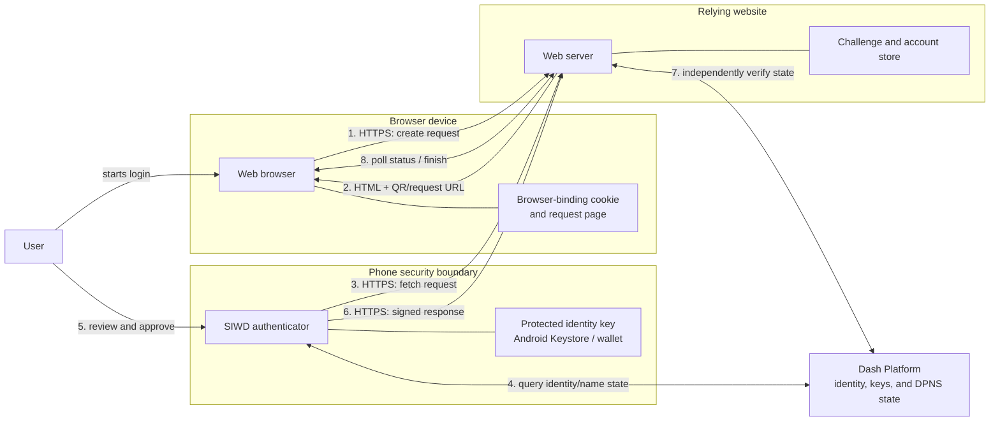
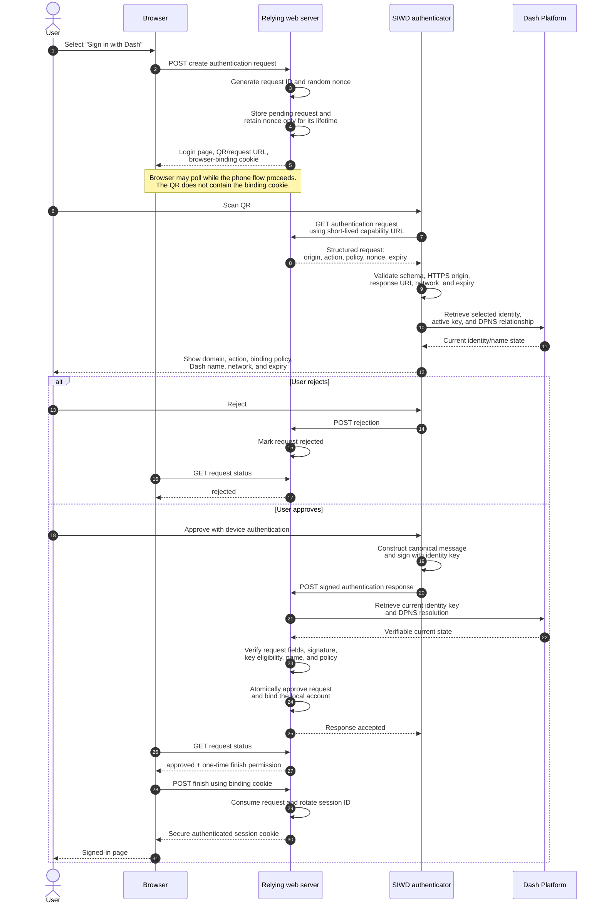
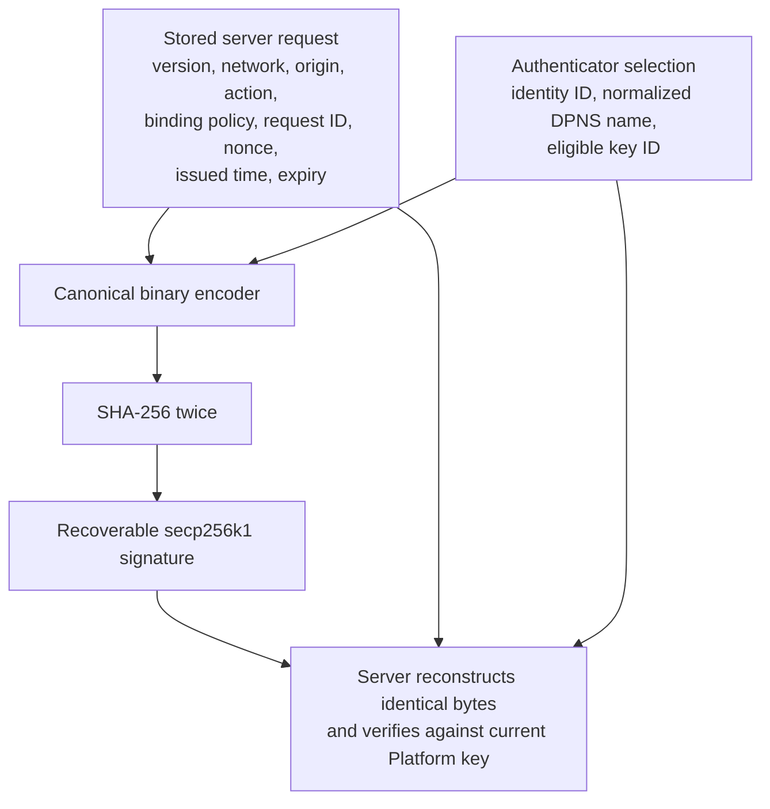
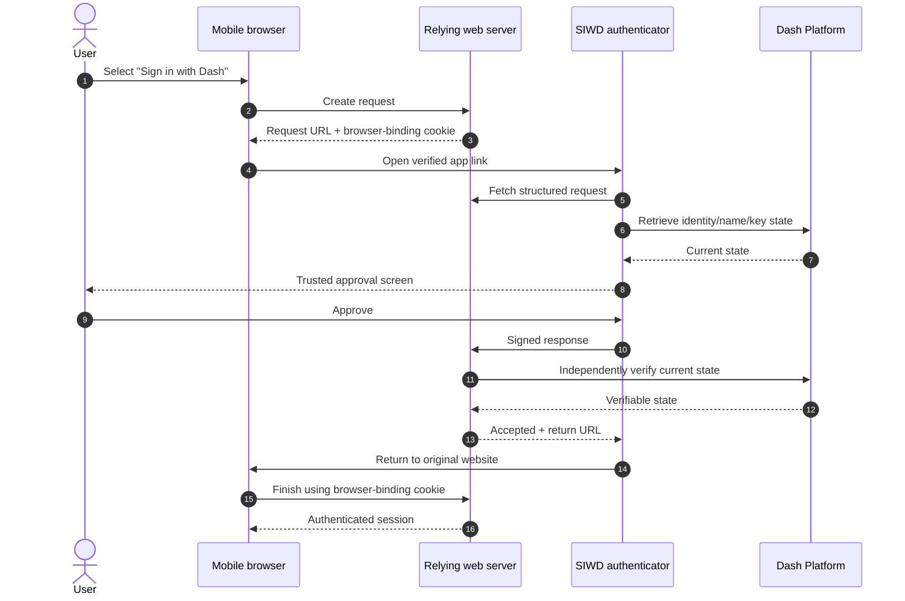
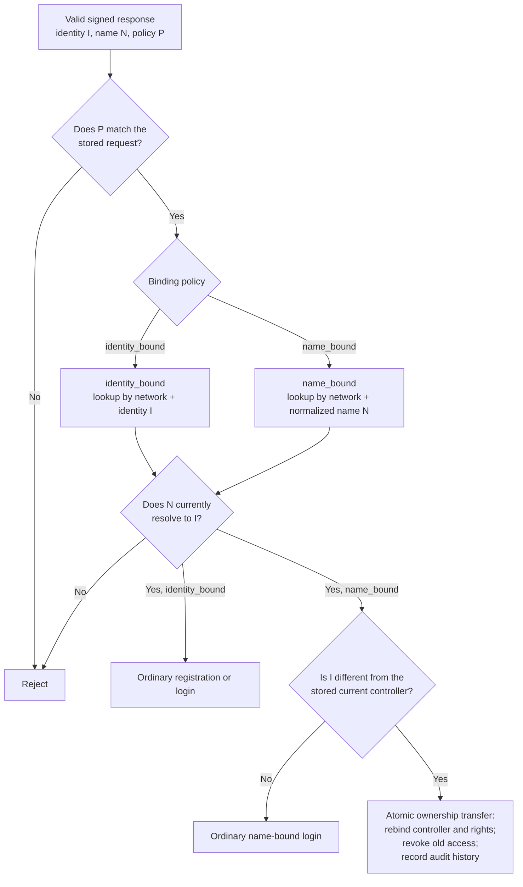
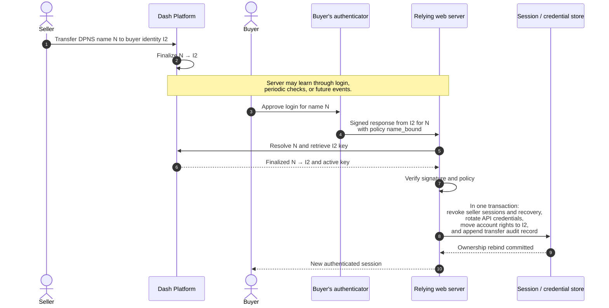

# Authentication and Message Flows

**Status:** Initial flow model  
**Protocol status:** Illustrative until Draft 1 fixes endpoint names and binary
encoding

This document shows how the browser, relying website, authenticator, and Dash
Platform communicate. It is the quickest introduction to the SIWD protocol.
The normative field definitions and verification rules remain in
[`PROTOCOL.md`](PROTOCOL.md).

## 1. Participants and trust boundaries

The browser and authenticator do not need a direct connection. The website
relays the request and response status, but it never receives the private key.
The QR contains a short-lived HTTPS capability URL, not a signature, recovery
phrase, or browser session cookie.

## 2. Cross-device login sequence

This is the primary desktop-browser plus phone flow. Registration and account
linking use the same transport with a different signed `action`.

### Why the browser-binding cookie matters

The phone's signed response approves a request but does not receive the
browser's web session. Only the browser that created the request and retained
the separate binding cookie can finish the login. This prevents possession of
the request URL or phone response alone from yielding a browser session.

Browser binding alone does **not** stop an attacker who creates a request in the
attacker's browser and persuades a victim to approve that QR, because the
attacker holds the correct cookie. The user must still confirm the real domain
and intended action. Draft 1 must add and test a stronger QR-forwarding defense,
such as a browser/phone confirmation value or another ceremony that binds the
approval to the user's browser.

## 3. Message inventory

Endpoint names are illustrative. Draft 1 may change the paths, but not the
separation of responsibilities.

| Message | Sender → receiver | Important contents | Authentication or protection |
| --- | --- | --- | --- |
| Create request | Browser → server | Action and site-selected binding policy | HTTPS, CSRF protection where applicable |
| Request page | Server → browser | QR capability URL, expiry, request status UI | HTTPS plus browser-binding cookie |
| Fetch request | Authenticator → server | High-entropy request capability | HTTPS, short lifetime, rate limiting |
| Authentication request | Server → authenticator | Request ID, nonce, origin, action, binding policy, timestamps, response URI, requested claims | Capability URL plus strict app validation |
| Platform lookup | Authenticator → Platform | Identity/name/key queries | Prefer SDK-verified proofs |
| Signed response | Authenticator → server | Request ID, policy, identity ID, DPNS name, key ID, algorithm, signature | Domain-bound canonical signature |
| Verification lookup | Server → Platform | Current identity keys, disabled state, and DPNS resolution | Prefer SDK-verified proofs |
| Status check | Browser → server | Request ID or server-side browser state | Browser-binding cookie; uniform status responses |
| Finish login | Browser → server | One-time approved request | Binding cookie, atomic consumption, session rotation |
| Session response | Server → browser | Local website session | Secure, HTTP-only, same-site cookie |

No message contains a recovery phrase or private key. Normal authentication
does not submit a Dash Platform state transition and does not consume Platform
credits.

## 4. What is signed

The authenticator signs the security-relevant request and response values, not
arbitrary website text and not the JSON serialization itself.

Changing the origin, action, binding policy, request ID, nonce, expiry,
identity, name, or key ID causes signature verification or request comparison
to fail.

## 5. Same-device flow

On a phone, the browser opens the same HTTPS request URL as a verified
application link. The cryptographic request and response do not change.

The return URL is navigation, not proof of authentication. The server accepts
only the signed response, and the browser still needs its original binding
cookie to receive a session.

## 6. Account-binding policy branch

The wire exchange proves the same relationship under both policies. The
website's stored policy determines which local provider record is selected.

For `identity_bound`, a transferred preferred name does not transfer the local
account. For `name_bound`, the current owner of the name controls the local
account and its transferable rights.

## 7. Name-bound ownership transfer sequence

The current controller may change on Dash Platform before either party visits
the website. A name-bound site therefore revalidates control during login and
before sensitive actions, and may additionally monitor for changes.

If revocation or ownership rebinding cannot complete, the transfer login fails
closed and no buyer session is issued. Historical records retain the identity
that performed each past action rather than being rewritten as actions by the
buyer.

## 8. Failure behavior

At every failure point, the server creates no session and performs no partial
account transfer:

- an expired, cancelled, rejected, approved, or consumed request cannot return
  to `pending`;
- malformed or mismatched fields fail before signature acceptance;
- an unknown, disabled, incorrectly scoped, or disallowed key is rejected;
- a name that does not currently resolve to the signing identity is rejected;
- a response with the wrong binding policy is rejected;
- a browser without the original binding cookie cannot finish an approved
  login; and
- a name-bound controller change is committed together with all required
  revocations or not committed at all.
